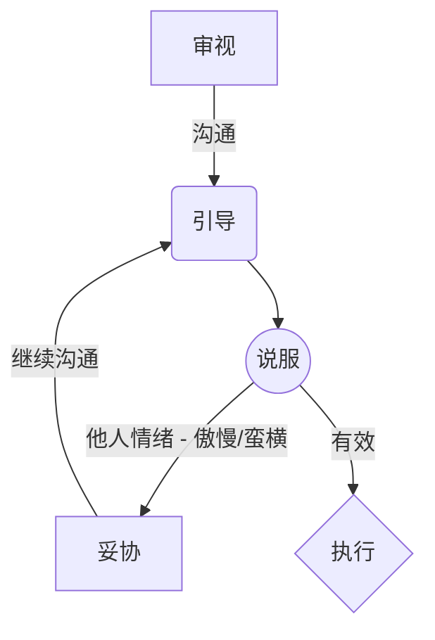

title: 写给 YY
author: azlar
date: '2023-01-23 06:22:14'
tags: [育儿，Y]
ignore: true
auth: true

---
爸爸爱你。

<!-- desc -->

# 过年回家
## 现状
### 今天早上
今天是大年初二，妈妈在无数的争吵后，决定要带你回隆回，和去年的剧情一摸一样。

爸爸没要阻止妈妈年前回家，妈妈以 “爸爸不让妈妈回家”、“爸爸阻止妈妈带熠熠回家” 为引，妄想被迫害，激励自己，（独自）带熠熠回家。

### 爸爸很想你
早 5.50，爸爸轻轻喊醒熟睡的你，告知你今天的行程、注意事项，你说，不要回隆回；经过一番讨论，爸爸发现你逻辑清晰：不想回隆回，不 care 高铁/烟花/姐姐/爷爷 等诱惑；想在北京，与爸爸妈妈一起（妈妈独自回，也接受不了）。

最后，妈妈以薯条为诱惑，带你出发了。

## 关于强势
**隆回，不是你的家乡**，而是你母亲的家乡。

#### 先说结论
爸爸妥协了。（爸爸其实根本不想让你回去，因为时间短、路程远，总共呆 5 天，2 天在路上，还有几天，在忍受你母亲无规划的的 赖：每天想着晚走、一天一天的推迟返程日、为车票殚精竭虑等等等。）

又一次放任了你母亲的（自我思乡）情绪，让她带你回去了。

你的母亲不会维系自己的家，也无法为你的将来做有效的思考。

爸爸的妥协，类似于《万箭穿心》中，女主最后的无奈：我的孩子，似乎从没有像其他孩子那样，总是心里压着事情一样。爸爸希望你开心有效（有人陪伴、有吃有喝）的情况下，想回就回（当然，本次你根本不想回，而爸爸，已经不想再去 争执）。

#### 经过
过年期间，妈妈多次在你面前，大声争论，并标榜自己“没有吵架”、“就是要在你面前大声”等，爸爸明白，你被吓到了。

经历几天后，从最开始 “妈妈不说话了” 演变为只敢对爸爸说 “daddy 不说话了”，爸爸肉眼可见的，观察到了你的细腻与敏感。

### 关于吵架
今年（2022 农历年底），吵架的主因：妈妈想回（隆回）去过年，幻想爸爸不同意，由此引发的一系列，无意义争吵。

爸爸的唯一态度：**不要在小孩面前大声**！（你可以回，也可以带熠熠回（熠熠同意的情况下），年前可回，年后亦可回）。

在爸爸的眼里：争吵是极度浪费人生的，它会导致你的精力被消耗，事业被阻止。爸爸的事业，很大程度受限于妈妈的情绪。（因需要拿出过多的情绪，去关注妈妈随时而来的恶魔情绪）

### 迟早会来临的逼迫
由于爸爸的一系列观察，妈妈性格中的傲慢与强势，迟早会影响到你，简单例子：早上你与爸爸妈妈进行逻辑清晰的讨论，你不想回隆回，妈妈直接威胁 “那妈妈自己走了？”，这种无效的沟通，就是 内耗 的基础。

你母亲虽然有一系列理论，但本体上，根本无法控制自己的情绪怪兽。

#### 想对你说的话
爸爸了解你的敏感，知道你一定会主动或被动的妥协，妥协/压抑 自己，来满足你母亲的某些思想/行为。

为了可能发生的最坏情况，爸爸有些话想对你说


#### 1. be yourself
不要受他们的影响。如意识到自己受影响，一定要及时在心内修复自己。

#### 2. 早享受
他们的教育里，缺失教明显的地方，就是对你的尊重与自爱的引导。

简单例子：喝饮料、玩游戏 的平衡问题。
    1. 在平日里，会严格的控制、压迫你，或给你建立很多的规则，“熠熠不可以”。
    2. 在实际中，会像外界释放妥协的信号：在聚会/和亲戚相处中，根本无法维持规则，以致让你明白 “原来只是对我的控制”
    3. 在越界之后，又会强制要求你遵守规则。你会变得困惑、无助。


爸爸给你的建议：早享受。
    1. 在少年/青年时期，爸爸会在保障你安全的情况下，与你沟通后，努力帮助你应获得、想获得的各类事物。
    2. 在后青年（16+）/成年（26 岁内），你需要通过书里/日常学来的东西，尝试性的建立自己的享受规则，找到自己和外界的平衡点。简单例子：你想吃到一个东西，你需要自己想办法，但，你**无需让所有人满意**。


#### 3. 不傲慢
傲慢，会带来偏见。视野的窄小，会影响视野、格局，无法控制自己，更无法控制别人。有的，只会是，只敢对身边人的情绪喷发，导致的争吵。

不傲慢的方案也很简单，了解更多的事情，打开自己的视野，而最简单的方式，即：**多读书、读很多的书**，无论是漫画，小说，历史，心理学，甚至成功学（妈妈的圣经，爸爸觉得最无意义的一类书），都会在某天某时，帮助到你。


#### 4. 审视
审视思维，需要尽早的培养。

在成长过程中，对父母的印象的加成分，很高。而越早的跳出这种 “印象分”，就可以越早的让你建立 “自我” 这个概念。

简单例子：爸爸的爸爸。

爸爸希望你能做到的，早日迈过 情绪的屏障，不被绑架、不被（自我因畏惧他人情绪、习惯等带来的）威胁、不过的压抑自己。

当你学会审视己身时，你也会具备审视他人的能力，通过不断的练习，你会成功掌握，引导自己的能力。


审视的效果，简单例子：


    本年回家（对你）没有任何意义。
    
    1. 你有很多地方要去，庙会/动物园/故宫/。不应该以你母亲的 思乡/我不了解北京文化 等理由，放弃这些东西。
    2. 回到隆回，除了解放了你母亲，对你来说，只是一次简单的 旅行体验；而这种体验，完全可以放到 夏天的暑假 来进行。
    3. 由于你身体最近的不适（咳嗽、吃酸会吐），回到隆回面临的风险，极高。


基于这种逻辑，爸爸很坚定的不然你回；而实际操作就是，你必须受身边人情绪的影响。


#### 5. 找到路
爸爸目前还在寻找，方案如图，但是效果并不是很理想。



我们一起进步，修复、提高自己。


# 究极内耗
年轻时候总是不懂，家和万事兴，等到了年纪才发现，“和” 是最重要也是最难做到的。
### 随便的例子
#### 背景
1. 熠熠在发烧、下午吃完退烧药，爸爸带熠熠出去玩
2. 姥姥说熠熠想吃水饺，念叨了两天（发烧前的昨天、发烧的今天）要去买饺子皮
3. 临出门，姥姥问爸爸给熠熠做什么吃，爸爸回答：粥、黄瓜炒点嫩肉

#### 到家后的现状
1. 姥姥拿出 晚上的白粥 + 中午的胡萝卜粥（中午没有拿出来也没有说有粥），给熠熠挑选、引导他喝胡萝卜粥（竟然因为怕浪费？？？？）
2. 餐桌上多了姥姥做的肉包子，并强行塞给熠熠吃，无视爸爸的阻拦（发烧不可以吃肉包，难消化）
3. 黄瓜炒肉 变成了 （硬）肉炒胡萝卜炒黄瓜（因为觉得熠熠想吃胡萝卜？？中午吃胡萝卜丝、晚上喝胡萝卜粥，然后）
4. 姥姥与爸爸如下对话：
    ```
    姥：你要吃粥吗？
    爸：可以，我和熠熠一起吃粥
    姥：只有粥了
    爸：......（菜饭都上桌了，难道问我是为了给我先煮饭吗。。。）
        
    爸：肉包你现在不可以吃，你生病了
    熠：我就要吃（发脾气）
    姥：肉包你不能吃、过期了
    熠：（哭喊）
    姥：好，给你拿，肉肉姥姥帮你拿出来
    （结果，还是给了一半肉给熠熠吃，问之答曰：得吃点肉）
    ```
    
#### 感触
真的太累了，每天对答都得照顾对方的敏感、埋的坑，有什么从来不直接说、阴奉阳违。

这样的家庭环境，如何让小孩阳光的成长呢。

### 随便的例子 - 2
#### 背景
1. 早餐每天吃姥姥做的一个鸡蛋 + 爸爸带回来的面包
2. 6 点吃晚饭（原定于每日 6.30 让小孩吃饭，爸爸特地拜托姥姥下午接熠熠前提前做好晚饭，但实际操作下来，没有一次遵守 6.30 这个时间点。。。）
3. 和出差中的妈妈接视频中

#### 内耗
妈妈开始责怪：1. 为什么 6 点不到就让他吃了；2. 为什么又是排骨胡萝卜这一个菜；3. 为什么又买面包

1. 姥：你以为他是不想吃饭？他是想吃面包（蛋糕）
2. 爸：面包是给他早上吃的，现在他在吃饭，也没有吃面包；难道早上，他就吃一个鸡蛋吗
3. 妈：（责难）姥姥为什么总是给他吃一个鸡蛋，我一个大人吃的都要吐了
4. 姥：你来做 * N ｜ 每天买的面包都吃不完，不吃浪费了，都丢掉了，浪费了
5. 妈：（责难*2）为什么总是买这么多面包，小孩吃多了面包不好
6. 爸：不要在他面前吵了、你什么都不知道就不要（挂电话）

事后，又开始质问爸爸：为什么买面包、为什么总是喜欢在家工作。。。

#### 感触
真的太心累了，不谈理解，连正常沟通都做不到的家庭。。。有时候爸爸真觉得是自己的无能，无法兼顾照顾熠熠与工作赚钱与让妈妈少点压力，才导致了这一切。。。

随便解释下：

1. 面包每天只买两包，一包日常吃，一包面包片备用（熠熠最近肠胃炎）
2. 每天的面包，为什么不能浪费了，难道扔一点多余的面包，违背了什么东西吗？走的爸爸公司餐补，不花完也是浪费啊？
3. 从熠熠上幼儿园，爸爸没在家办过一天工，只是每天 5.30-6.30 之间到家；且：
    1. **正常家庭有人腾出时间来补贴家庭带小孩，难道不应该是感谢 + 商量怎么规划时间吗？**
    2. 如果爸爸不回来，姥姥无法带熠熠**出去**玩，这个难题，谁来解决？纯靠要求姥姥吗？
    3. **真实现状：**爸爸每天回来后，陪熠熠吃饭、玩、洗澡、擦身体乳、换衣、刷牙、整理床与加湿器、陪睡觉；而姥姥洗碗后直接回房间刷手机（如果是爸爸的爸爸/妈妈，爸爸一定能协调好这些东西）

4. 也是最重要的，全场的吵架/扯皮，都只是围绕妈妈和姥姥的个人情绪/性格，相互攻击与拉扯，从 A 问题延伸到 B 问题 再到 C 问题，然而根本没有解决任何实质问题

宝宝的作息、成长，是建立在一家人所有人的努力上的，而不是推卸、扯皮、拒绝沟通和摆烂。


